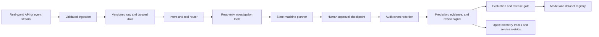

# Architecture

## Problem

Production teams need agentic automation without allowing an LLM-style planner to execute unsafe remediation.

## System Flow

## Components

- **Intent and tool router**
- **Read-only investigation tools**
- **State-machine planner**
- **Human approval checkpoint**
- **Audit event recorder**

## Recommended Production Stack

- FastAPI for incident and approval APIs
- LangGraph for durable multi-agent orchestration
- PostgreSQL for checkpoints and audit events
- Redis for queues, locks, and idempotency
- OpenTelemetry plus Prometheus and Grafana
- Docker Compose for reproducible service integration

## Hugging Face Tasks

- `text-classification`
- `text-generation`
- `summarization`
- `question-answering`

## Model Architecture

The included baseline is a transparent token-prototype model. Training builds
per-label token weights and inverse-document-frequency retrieval weights from
the synthetic training split. The runtime returns a prediction, confidence,
review flag, and evidence documents. This baseline is intentionally small so
it can run in CI without paid compute.

For production, compare it with domain embeddings, gradient-boosted models, or
fine-tuned transformer models using the same held-out evaluation contract.

## Production Boundaries

- Validate and version all input schemas.
- Keep human review for low-confidence or high-impact decisions.
- Store prompts, traces, model versions, and dataset versions together.
- Do not treat synthetic evaluation performance as production evidence.
- Add authentication, authorization, encryption, and retention controls.

## Known Risks

The generated agent uses simulated tools. Production integrations must enforce least privilege and human approval.
